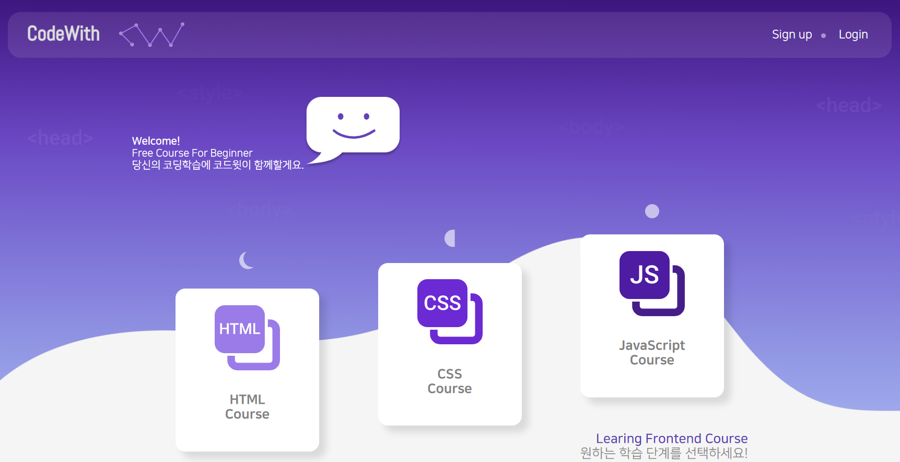
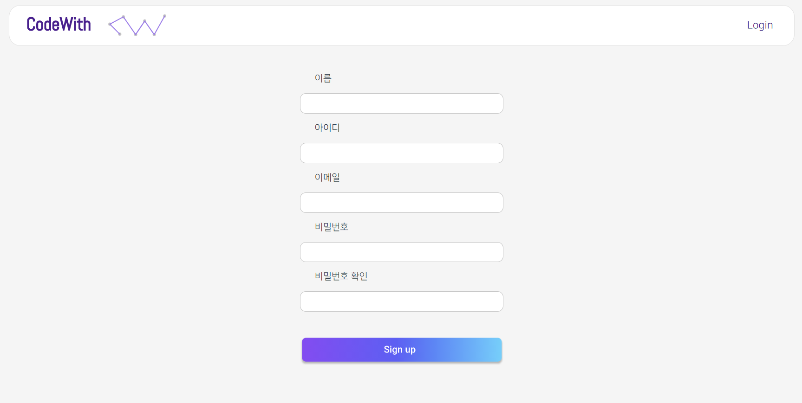
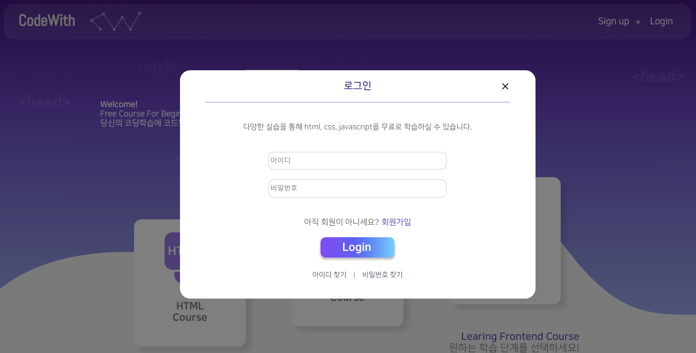
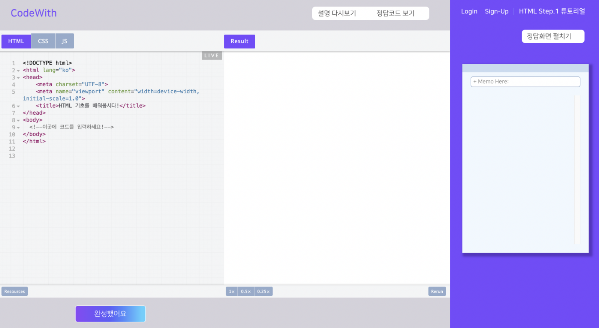
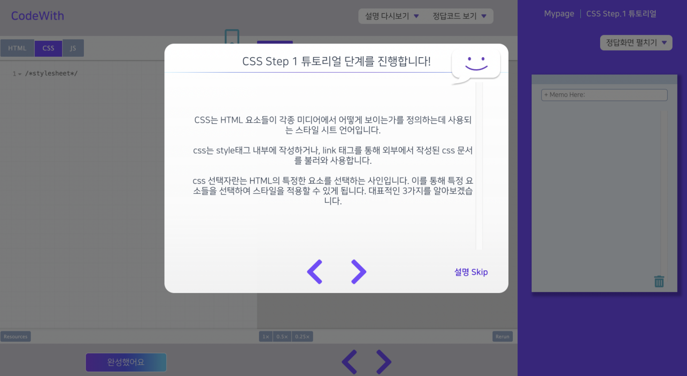
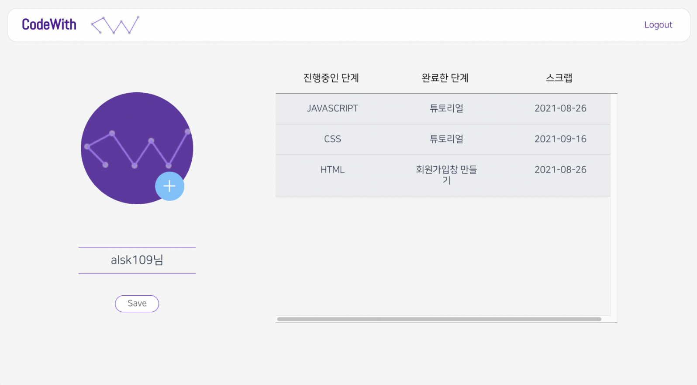

# CodeWith

### 프로젝트 소개

html/css 등의 웹 프론트엔드 언어를 사용해 직접 코딩해보면서 학습할 수 있도록 도와주는 코딩학습 사이트. 

### 프로젝트 개발 환경

- Design : Figma

- FRONT-END : HTML, CSS, Javascript, Vue.js

- BACK-END : Java, Sprint Boot, AWS EC2, S3

- Database : MySQL, ERDCloud

- 협업 툴 : Slack, Github, 노션

  

### 프로젝트 기간

2021.06.20 ~ 2021.08.19 (기획 & 개발)

# 

